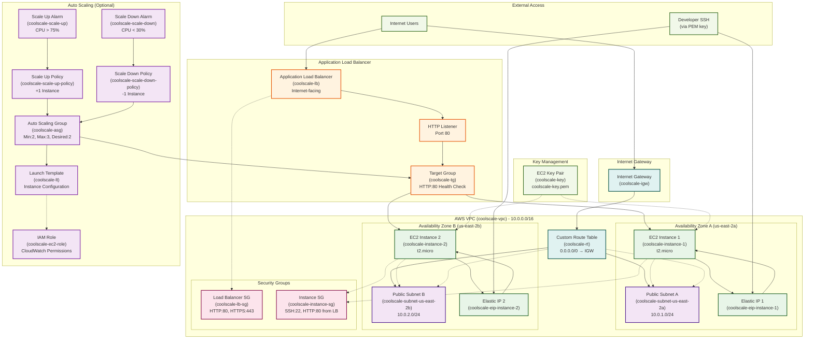

# AWS Load Balancer Infrastructure

This project creates a complete AWS load balancer infrastructure using Python boto3, including a custom VPC, subnets, security groups, EC2 instances with Flask web servers, and an Application Load Balancer.

## Table of Contents

1. [Summary](#summary)
2. [Resource Creation Details](#resource-creation-details)
3. [Deletion Process](#deletion-process)
4. [Sample Output](#sample-output)
5. [Prerequisites](#prerequisites)

## Summary

### Architecture Diagram



### Resource Creation Order

The infrastructure is created in the following order to ensure proper dependencies:

1. **VPC Creation** - Creates a custom VPC with CIDR `10.0.0.0/16`
2. **Subnet Creation** - Creates 2 public subnets in different AZs (`10.0.1.0/24`, `10.0.2.0/24`)
3. **Internet Gateway Setup** - Creates and attaches IGW with routing configuration
4. **Route Table Configuration** - Creates custom route table and removes blackhole routes
5. **Security Groups** - Creates LB and instance security groups with appropriate rules
6. **Key Pair** - Creates EC2 key pair and saves PEM file locally
7. **AMI Selection** - Finds latest Amazon Linux 2 AMI
8. **IAM Instance Profile** - Creates IAM role and instance profile with propagation wait (auto scaling mode only)
9. **EC2 Instances** - Launches 2 instances with Flask web server in different AZs (standard mode only)
10. **Elastic IPs** - Creates and attaches Elastic IPs to instances (standard mode only)
11. **Target Group** - Creates target group and registers EC2 instances
12. **Load Balancer** - Creates Application Load Balancer with HTTP listener
13. **Launch Template** - Creates launch template with base64-encoded user data and IAM validation (auto scaling mode only)
14. **Auto Scaling Group** - Creates ASG with min:2, max:3, desired:2 (auto scaling mode only)
15. **Scaling Policies** - Creates scale-up and scale-down policies for ASG (auto scaling mode only, not tagged)
16. **CloudWatch Alarms** - Creates CPU-based scaling alarms linked to policies (auto scaling mode only)
17. **Health Checks** - Configures health checks and waits for active state
18. **Automated Testing** - Tests load balancer with curl and validates Flask response

### Infrastructure Components

#### Standard Mode:
- **1 Custom VPC** with DNS support
- **2 Public Subnets** in different availability zones
- **1 Internet Gateway** with routing configuration
- **1 Custom Route Table** with proper internet routing (no blackhole routes)
- **2 Security Groups** (LB and instance)
- **1 EC2 Key Pair** with local PEM file
- **2 EC2 Instances** running Flask web servers
- **2 Elastic IPs** attached to instances
- **1 Target Group** with health checks
- **1 Application Load Balancer** with HTTP listener
- **Automated Testing** with curl verification
- **Idempotent Operations** - safe to re-run multiple times

#### Auto Scaling Mode (--enable-autoscaling):
- **1 Custom VPC** with DNS support
- **2 Public Subnets** in different availability zones
- **1 Internet Gateway** with routing configuration
- **1 Custom Route Table** with proper internet routing (no blackhole routes)
- **2 Security Groups** (LB and instance)
- **1 EC2 Key Pair** with local PEM file
- **1 Launch Template** defining instance configuration
- **1 Auto Scaling Group** (min: 2, max: 3, desired: 2)
- **2 Scaling Policies** (scale-up and scale-down)
- **2 CloudWatch Alarms** for CPU-based scaling
- **1 IAM Role** with CloudWatch permissions
- **1 IAM Instance Profile** for EC2 instances
- **1 Target Group** with health checks
- **1 Application Load Balancer** with HTTP listener
- **Automated Testing** with curl verification
- **Idempotent Operations** - safe to re-run multiple times

## Resource Creation Details

### 1. VPC Creation

Creates a custom VPC to avoid conflicts with default VPC resources.

**boto3 Code:**
```python
vpc = ec2.create_vpc(
    CidrBlock='10.0.0.0/16',
    TagSpecifications=[{
        'ResourceType': 'vpc',
        'Tags': [
            {'Key': 'Name', 'Value': 'coolscale-vpc'},
            {'Key': 'Project', 'Value': 'Coolscale'}
        ]
    }]
)
# Enable DNS hostnames
ec2_client.modify_vpc_attribute(VpcId=vpc_id, EnableDnsHostnames={'Value': True})
ec2_client.modify_vpc_attribute(VpcId=vpc_id, EnableDnsSupport={'Value': True})
```

**AWS CLI Equivalent:**
```bash
aws ec2 create-vpc --cidr-block 10.0.0.0/16 --tag-specifications 'ResourceType=vpc,Tags=[{Key=Name,Value=coolscale-vpc},{Key=Project,Value=Coolscale}]'
aws ec2 modify-vpc-attribute --vpc-id vpc-12345678 --enable-dns-hostnames
aws ec2 modify-vpc-attribute --vpc-id vpc-12345678 --enable-dns-support
```

### 2. Subnet Creation

Creates public subnets in different availability zones for high availability.

**boto3 Code:**
```python
subnet = ec2.create_subnet(
    VpcId=vpc_id,
    CidrBlock='10.0.1.0/24',
    AvailabilityZone='us-east-2a',
    TagSpecifications=[{
        'ResourceType': 'subnet',
        'Tags': [
            {'Key': 'Name', 'Value': 'coolscale-subnet-us-east-2a'},
            {'Key': 'Project', 'Value': 'Coolscale'}
        ]
    }]
)
# Enable auto-assign public IP
ec2_client.modify_subnet_attribute(
    SubnetId=subnet.id,
    MapPublicIpOnLaunch={'Value': True}
)
```

**AWS CLI Equivalent:**
```bash
aws ec2 create-subnet --vpc-id vpc-12345678 --cidr-block 10.0.1.0/24 --availability-zone us-east-2a --tag-specifications 'ResourceType=subnet,Tags=[{Key=Name,Value=coolscale-subnet-us-east-2a},{Key=Project,Value=Coolscale}]'
aws ec2 modify-subnet-attribute --subnet-id subnet-12345678 --map-public-ip-on-launch
```

### 3. Internet Gateway Setup

Creates and attaches an Internet Gateway for public internet access, along with proper route table configuration.

**boto3 Code:**
```python
igw = ec2.create_internet_gateway(
    TagSpecifications=[{
        'ResourceType': 'internet-gateway',
        'Tags': [
            {'Key': 'Name', 'Value': 'coolscale-igw'},
            {'Key': 'Project', 'Value': 'Coolscale'}
        ]
    }]
)
igw.attach_to_vpc(VpcId=vpc_id)

# Create custom route table for Internet access
custom_route_table = ec2.create_route_table(
    VpcId=vpc_id,
    TagSpecifications=[{
        'ResourceType': 'route-table',
        'Tags': [
            {'Key': 'Name', 'Value': 'coolscale-rt'},
            {'Key': 'Project', 'Value': 'Coolscale'}
        ]
    }]
)

# Remove any blackhole routes for 0.0.0.0/0
for route in existing_routes:
    if (route.destination_cidr_block == '0.0.0.0/0' and 
        hasattr(route, 'gateway_id') and 
        route.gateway_id == 'local'):
        custom_route_table.delete_route(DestinationCidrBlock='0.0.0.0/0')

# Add route to Internet Gateway
custom_route_table.create_route(
    DestinationCidrBlock='0.0.0.0/0',
    GatewayId=igw_id
)

# Associate subnets with custom route table
for subnet in selected_subnets:
    custom_route_table.associate_with_subnet(SubnetId=subnet.id)
```

**AWS CLI Equivalent:**
```bash
aws ec2 create-internet-gateway --tag-specifications 'ResourceType=internet-gateway,Tags=[{Key=Name,Value=coolscale-igw},{Key=Project,Value=Coolscale}]'
aws ec2 attach-internet-gateway --internet-gateway-id igw-12345678 --vpc-id vpc-12345678

# Create custom route table
aws ec2 create-route-table --vpc-id vpc-12345678 --tag-specifications 'ResourceType=route-table,Tags=[{Key=Name,Value=coolscale-rt},{Key=Project,Value=Coolscale}]'

# Delete any blackhole routes (if they exist)
aws ec2 delete-route --route-table-id rtb-12345678 --destination-cidr-block 0.0.0.0/0

# Add route to Internet Gateway
aws ec2 create-route --route-table-id rtb-12345678 --destination-cidr-block 0.0.0.0/0 --gateway-id igw-12345678

# Associate subnets with custom route table
aws ec2 associate-route-table --route-table-id rtb-12345678 --subnet-id subnet-12345678
aws ec2 associate-route-table --route-table-id rtb-12345678 --subnet-id subnet-87654321
```

#### Route Table Configuration Details

The script creates a **custom route table** to ensure proper internet connectivity:

1. **Custom Route Table Creation**: Creates a dedicated route table for the VPC instead of relying on the main route table
2. **Blackhole Route Removal**: Automatically detects and removes any blackhole routes for `0.0.0.0/0` that might prevent internet access
3. **Internet Gateway Route**: Adds a proper route from `0.0.0.0/0` to the Internet Gateway
4. **Subnet Association**: Associates all subnets with the custom route table to ensure internet access

This approach ensures that:
- All subnets have proper internet connectivity
- No conflicting or blackhole routes interfere with traffic
- The routing configuration is explicit and controlled
- Public subnets can properly reach the internet and receive traffic from the internet

### 4. Route Table Configuration

The script includes comprehensive route table management to ensure proper internet connectivity.

**Key Features:**
- **Custom Route Table**: Creates a dedicated route table instead of modifying the main route table
- **Blackhole Route Detection**: Automatically identifies and removes problematic blackhole routes
- **Internet Gateway Routing**: Establishes proper routing to the Internet Gateway
- **Subnet Association**: Associates all subnets with the custom route table

**Blackhole Route Handling:**
```python
# Remove any blackhole routes for 0.0.0.0/0
blackhole_routes_removed = 0
for route in existing_routes:
    if (route.destination_cidr_block == '0.0.0.0/0' and 
        hasattr(route, 'gateway_id') and 
        route.gateway_id == 'local'):
        # This is a blackhole route, remove it
        custom_route_table.delete_route(DestinationCidrBlock='0.0.0.0/0')
        blackhole_routes_removed += 1
```

**Why This Matters:**
- **Blackhole Routes**: Can prevent internet access even with a properly configured Internet Gateway
- **Explicit Control**: Custom route table gives complete control over routing decisions
- **Troubleshooting**: Makes routing configuration visible and debuggable
- **Best Practices**: Follows AWS networking best practices for custom VPCs

### 5. Security Group Creation

Creates security groups for the load balancer and EC2 instances.

**boto3 Code (Load Balancer SG):**
```python
lb_sg = ec2.create_security_group(
    GroupName='coolscale-lb-sg',
    Description='Security group for ALB',
    VpcId=vpc_id,
    TagSpecifications=[{
        'ResourceType': 'security-group',
        'Tags': [{'Key': 'Name', 'Value': 'coolscale-lb-sg'}, {'Key': 'Project', 'Value': 'Coolscale'}]
    }]
)
lb_sg.authorize_ingress(
    IpPermissions=[
        {'IpProtocol': 'tcp', 'FromPort': 80, 'ToPort': 80,
         'IpRanges': [{'CidrIp': '0.0.0.0/0'}]},
        {'IpProtocol': 'tcp', 'FromPort': 443, 'ToPort': 443,
         'IpRanges': [{'CidrIp': '0.0.0.0/0'}]}
    ]
)
```

**AWS CLI Equivalent:**
```bash
aws ec2 create-security-group --group-name coolscale-lb-sg --description "Security group for ALB" --vpc-id vpc-12345678 --tag-specifications 'ResourceType=security-group,Tags=[{Key=Name,Value=coolscale-lb-sg},{Key=Project,Value=Coolscale}]'
aws ec2 authorize-security-group-ingress --group-id sg-12345678 --protocol tcp --port 80 --cidr 0.0.0.0/0
aws ec2 authorize-security-group-ingress --group-id sg-12345678 --protocol tcp --port 443 --cidr 0.0.0.0/0
```

### 6. Key Pair Creation

Creates an EC2 key pair and saves the private key locally.

**boto3 Code:**
```python
key_pair = ec2_client.create_key_pair(KeyName='coolscale-key')
with open('./coolscale-key.pem', 'w') as f:
    f.write(key_pair['KeyMaterial'])
os.chmod('./coolscale-key.pem', 0o400)
```

**AWS CLI Equivalent:**
```bash
aws ec2 create-key-pair --key-name coolscale-key --query 'KeyMaterial' --output text > coolscale-key.pem
chmod 400 coolscale-key.pem
```

### 7. EC2 Instance Launch

Launches EC2 instances with user data script to install Flask web server.

**boto3 Code:**
```python
instance = ec2.create_instances(
    ImageId='ami-12345678',
    InstanceType='t2.micro',
    KeyName='coolscale-key',
    MinCount=1,
    MaxCount=1,
    UserData=user_data_script,
    NetworkInterfaces=[{
        'SubnetId': 'subnet-12345678',
        'DeviceIndex': 0,
        'AssociatePublicIpAddress': True,
        'Groups': ['sg-12345678']
    }],
    TagSpecifications=[{
        'ResourceType': 'instance',
        'Tags': [
            {'Key': 'Name', 'Value': 'coolscale-instance-1'}, 
            {'Key': 'Project', 'Value': 'Coolscale'}
        ]
    }]
)[0]
```

**AWS CLI Equivalent:**
```bash
aws ec2 run-instances --image-id ami-12345678 --instance-type t2.micro --key-name coolscale-key --subnet-id subnet-12345678 --security-group-ids sg-12345678 --associate-public-ip-address --user-data file://user-data.sh --tag-specifications 'ResourceType=instance,Tags=[{Key=Name,Value=coolscale-instance-1},{Key=Project,Value=Coolscale}]'
```

### 8. Target Group Creation

Creates a target group and registers EC2 instances for load balancing.

**boto3 Code:**
```python
tg_response = elbv2.create_target_group(
    Name='coolscale-tg',
    Protocol='HTTP',
    Port=80,
    VpcId=vpc_id,
    HealthCheckProtocol='HTTP',
    HealthCheckPort='80',
    HealthCheckPath='/',
    TargetType='instance',
    Tags=[{'Key': 'Project', 'Value': 'Coolscale'}]
)
tg_arn = tg_response['TargetGroups'][0]['TargetGroupArn']

# Register instances
elbv2.register_targets(
    TargetGroupArn=tg_arn,
    Targets=[{'Id': instance_id} for instance_id in instance_ids]
)
```

**AWS CLI Equivalent:**
```bash
aws elbv2 create-target-group --name coolscale-tg --protocol HTTP --port 80 --vpc-id vpc-12345678 --health-check-protocol HTTP --health-check-port 80 --health-check-path / --target-type instance --tags Key=Project,Value=Coolscale
aws elbv2 register-targets --target-group-arn arn:aws:elasticloadbalancing:us-east-2:123456789012:targetgroup/coolscale-tg/1234567890abcdef --targets Id=i-1234567890abcdef0 Id=i-0987654321fedcba0
```

### 9. Load Balancer Creation

Creates an Application Load Balancer with HTTP listener.

**boto3 Code:**
```python
lb_response = elbv2.create_load_balancer(
    Name='coolscale-lb',
    Subnets=['subnet-12345678', 'subnet-87654321'],
    SecurityGroups=['sg-12345678'],
    Scheme='internet-facing',
    Type='application',
    IpAddressType='ipv4',
    Tags=[{'Key': 'Project', 'Value': 'Coolscale'}]
)
lb_arn = lb_response['LoadBalancers'][0]['LoadBalancerArn']

# Create HTTP listener
elbv2.create_listener(
    LoadBalancerArn=lb_arn,
    Protocol='HTTP',
    Port=80,
    DefaultActions=[{
        'Type': 'forward',
        'TargetGroupArn': tg_arn
    }]
)
```

**AWS CLI Equivalent:**
```bash
aws elbv2 create-load-balancer --name coolscale-lb --subnets subnet-12345678 subnet-87654321 --security-groups sg-12345678 --scheme internet-facing --type application --ip-address-type ipv4 --tags Key=Project,Value=Coolscale
aws elbv2 create-listener --load-balancer-arn arn:aws:elasticloadbalancing:us-east-2:123456789012:loadbalancer/app/coolscale-lb/1234567890abcdef --protocol HTTP --port 80 --default-actions Type=forward,TargetGroupArn=arn:aws:elasticloadbalancing:us-east-2:123456789012:targetgroup/coolscale-tg/1234567890abcdef
```

### 10. Automated Testing

The script automatically tests the load balancer to ensure it's working correctly and returning the expected Flask application response.

**boto3 Code:**
```python
import requests
from urllib3.exceptions import InsecureRequestWarning

# Disable SSL warnings for testing
requests.packages.urllib3.disable_warnings(InsecureRequestWarning)

# Test with multiple attempts to handle DNS propagation
max_attempts = 10
test_url = f"http://{dns_name}"

for attempt in range(1, max_attempts + 1):
    try:
        response = requests.get(test_url, timeout=10, verify=False)
        if response.status_code == 200:
            json_response = response.json()
            print(json.dumps(json_response, indent=2))
            break
    except requests.exceptions.ConnectionError:
        time.sleep(30)  # Wait for DNS propagation
```

**AWS CLI Equivalent:**
```bash
# Manual testing after deployment
curl http://coolscale-lb-1234567890.us-east-2.elb.amazonaws.com
```

**Expected Response:**
```json
{
  "hostname": "ip-10-0-1-123.us-east-2.compute.internal",
  "local_ip": "10.0.1.123",
  "metadata": {
    "instance-id": "i-1234567890abcdef0",
    "instance-type": "t2.micro",
    "availability-zone": "us-east-2a",
    "local-ipv4": "10.0.1.123",
    "public-ipv4": "54.123.45.67",
    "local-hostname": "ip-10-0-1-123.us-east-2.compute.internal",
    "public-hostname": "ec2-54-123-45-67.us-east-2.compute.amazonaws.com",
    "security-groups": "coolscale-instance-sg",
    "iam/instance-profile": "Not available"
  },
  "message": "Flask server running successfully!"
}
```

## Deletion Process

The deletion script (`delete_lb.py`) removes all resources in the proper order to handle dependencies:

### Deletion Order

1. **Delete CloudWatch Alarms** - Must be deleted before Auto Scaling Groups
2. **Delete Scaling Policies** - Remove auto scaling policies
3. **Delete Load Balancer Listeners** - Must be deleted before load balancers
4. **Delete Load Balancers** - Remove ALB instances
5. **Delete Target Groups** - Remove target groups (now safe to delete)
6. **Delete Auto Scaling Groups** - Terminates instances automatically
7. **Terminate EC2 Instances** - Stop and terminate remaining instances
8. **Delete Launch Templates** - Remove launch templates
9. **Delete IAM Instance Profiles** - Remove IAM instance profiles
10. **Delete IAM Roles** - Remove IAM roles
11. **Delete Security Groups** - Remove security group rules
12. **Delete Internet Gateways** - Detach and delete IGWs
13. **Delete Subnets** - Remove custom subnets
14. **Delete VPCs** - Remove custom VPC
15. **Delete Route Tables** - Remove custom route tables
16. **Release Elastic IPs** - Release Elastic IP addresses
17. **Delete Key Pairs** - Remove EC2 key pairs
18. **Delete Local Files** - Remove PEM files (optional)

### Usage

```bash
python3 delete_lb.py
```

The script will:
- Scan for all resources tagged with "Project=Coolscale"
- Display a summary of found resources
- Ask for confirmation before deletion
- Delete all resources in the proper order
- Provide detailed status updates throughout the process

## Sample Output

### Creation Script Output

```
[2025-10-05 14:30:25] [INFO] Starting infrastructure deployment...
[2025-10-05 14:30:25] [INFO] Current AWS Region: us-east-2
[2025-10-05 14:30:25] [INFO] All resources will be created in region: us-east-2

[2025-10-05 14:30:26] [INFO] Creating new VPC in region us-east-2...
[2025-10-05 14:30:27] [INFO] Created new VPC: vpc-0b1fdf22ca197e15a
[2025-10-05 14:30:28] [INFO] Enabled DNS hostnames and support for VPC

[2025-10-05 14:30:29] [INFO] Creating subnets in different availability zones...
[2025-10-05 14:30:30] [INFO] Available AZs in region: ['us-east-2a', 'us-east-2b', 'us-east-2c']
[2025-10-05 14:30:31] [INFO] Creating subnet coolscale-subnet-us-east-2a in AZ us-east-2a with CIDR 10.0.1.0/24
[2025-10-05 14:30:32] [INFO] Created subnet subnet-1234567890abcdef0 in AZ us-east-2a
[2025-10-05 14:30:33] [INFO] Creating subnet coolscale-subnet-us-east-2b in AZ us-east-2b with CIDR 10.0.2.0/24
[2025-10-05 14:30:34] [INFO] Created subnet subnet-0987654321fedcba0 in AZ us-east-2b

[2025-10-05 14:30:35] [INFO] Creating Internet Gateway and configuring routing...
[2025-10-05 14:30:36] [INFO] Created Internet Gateway: igw-1234567890abcdef0
[2025-10-05 14:30:37] [INFO] Attached Internet Gateway igw-1234567890abcdef0 to VPC vpc-0b1fdf22ca197e15a

[2025-10-05 14:30:38] [INFO] Creating security group for load balancer: coolscale-lb-sg
[2025-10-05 14:30:39] [INFO] Created LB security group: sg-1234567890abcdef0
[2025-10-05 14:30:40] [INFO] Creating security group for EC2 instances: coolscale-instance-sg
[2025-10-05 14:30:41] [INFO] Created instance security group: sg-0987654321fedcba0

[2025-10-05 14:30:42] [INFO] Creating key pair: coolscale-key
[2025-10-05 14:30:43] [INFO] Created and saved key pair: coolscale-key

[2025-10-05 14:30:44] [INFO] Searching for latest Amazon Linux 2 AMI in region us-east-2...
[2025-10-05 14:30:45] [INFO] Found latest Amazon Linux 2 AMI: ami-0c02fb55956c7d316

[2025-10-05 14:30:46] [INFO] Launching 2 EC2 instances with Flask web server...
[2025-10-05 14:30:47] [INFO] Creating first instance in subnet subnet-1234567890abcdef0 (us-east-2a)
[2025-10-05 14:30:48] [INFO] Created first instance: i-1234567890abcdef0
[2025-10-05 14:30:49] [INFO] Creating second instance in subnet subnet-0987654321fedcba0 (us-east-2b)
[2025-10-05 14:30:50] [INFO] Created second instance: i-0987654321fedcba0
[2025-10-05 14:30:51] [INFO] Waiting for instances to reach running state...
[2025-10-05 14:32:45] [INFO] All instances are now running

[2025-10-05 14:32:46] [INFO] Creating target group: coolscale-tg
[2025-10-05 14:32:47] [INFO] Created target group: coolscale-tg (ARN: arn:aws:elasticloadbalancing:us-east-2:123456789012:targetgroup/coolscale-tg/1234567890abcdef)
[2025-10-05 14:32:48] [INFO] Registered 2 instances with target group

[2025-10-05 14:32:49] [INFO] Creating Application Load Balancer: coolscale-lb
[2025-10-05 14:32:50] [INFO] Created load balancer: coolscale-lb (ARN: arn:aws:elasticloadbalancing:us-east-2:123456789012:loadbalancer/app/coolscale-lb/1234567890abcdef)
[2025-10-05 14:32:51] [INFO] Load balancer DNS name: coolscale-lb-1234567890.us-east-2.elb.amazonaws.com

[2025-10-05 14:32:52] [INFO] Creating HTTP listener on port 80...
[2025-10-05 14:32:53] [INFO] Created HTTP listener: arn:aws:elasticloadbalancing:us-east-2:123456789012:listener/app/coolscale-lb/1234567890abcdef/1234567890abcdef

[2025-10-05 14:32:54] [INFO] Waiting for load balancer to become active...
[2025-10-05 14:35:30] [INFO] Load balancer is now active and ready to serve traffic

============================================================
DEPLOYMENT SUMMARY
============================================================
[2025-10-05 14:35:31] [SUCCESS] AWS Region: us-east-2
[2025-10-05 14:35:31] [SUCCESS] Load Balancer DNS: coolscale-lb-1234567890.us-east-2.elb.amazonaws.com
[2025-10-05 14:35:31] [SUCCESS] Load Balancer ARN: arn:aws:elasticloadbalancing:us-east-2:123456789012:loadbalancer/app/coolscale-lb/1234567890abcdef
[2025-10-05 14:35:31] [SUCCESS] Target Group ARN: arn:aws:elasticloadbalancing:us-east-2:123456789012:targetgroup/coolscale-tg/1234567890abcdef
[2025-10-05 14:35:31] [SUCCESS] EC2 Instance IDs: ['i-1234567890abcdef0', 'i-0987654321fedcba0']
[2025-10-05 14:35:31] [SUCCESS] PEM file location: ./coolscale-key.pem

SSH COMMANDS (Copy & Paste Ready):
  Note: Make sure the PEM file has correct permissions: chmod 400 ./coolscale-key.pem

  Instance 1: ssh -i ./coolscale-key.pem ec2-user@54.123.45.67
  Instance 2: ssh -i ./coolscale-key.pem ec2-user@54.987.65.43

TESTING COMMANDS:
  Test Flask app: curl http://coolscale-lb-1234567890.us-east-2.elb.amazonaws.com
  Test specific instance: curl http://<instance-public-ip>
============================================================
[2025-10-05 14:35:32] [SUCCESS] You can now access your Flask application via the load balancer DNS name!
[2025-10-05 14:35:33] [SUCCESS] Each request will show which instance is serving the request.

[2025-10-05 14:35:34] [INFO] ============================================================
[2025-10-05 14:35:34] [INFO] TESTING LOAD BALANCER WITH CURL
[2025-10-05 14:35:34] [INFO] ============================================================
[2025-10-05 14:35:35] [INFO] Testing load balancer endpoint: http://coolscale-lb-1234567890.us-east-2.elb.amazonaws.com
[2025-10-05 14:35:35] [INFO] Note: DNS propagation may take a few minutes...
[2025-10-05 14:35:36] [INFO] Attempt 1/10 - Testing load balancer...
[2025-10-05 14:36:06] [INFO] Attempt 2/10 - Testing load balancer...
[2025-10-05 14:36:36] [SUCCESS] ✅ LOAD BALANCER TEST SUCCESSFUL!
[2025-10-05 14:36:36] [SUCCESS] Status Code: 200
[2025-10-05 14:36:36] [SUCCESS] Response Headers: {'content-type': 'application/json', 'content-length': '456', 'date': 'Mon, 05 Oct 2025 14:36:36 GMT', 'server': 'gunicorn/20.1.0'}
[2025-10-05 14:36:36] [SUCCESS] 
[2025-10-05 14:36:36] [SUCCESS] Response Body:
[2025-10-05 14:36:36] [SUCCESS] ----------------------------------------
{
  "hostname": "ip-10-0-1-123.us-east-2.compute.internal",
  "local_ip": "10.0.1.123",
  "metadata": {
    "instance-id": "i-1234567890abcdef0",
    "instance-type": "t2.micro",
    "availability-zone": "us-east-2a",
    "local-ipv4": "10.0.1.123",
    "public-ipv4": "54.123.45.67",
    "local-hostname": "ip-10-0-1-123.us-east-2.compute.internal",
    "public-hostname": "ec2-54-123-45-67.us-east-2.compute.amazonaws.com",
    "security-groups": "coolscale-instance-sg",
    "iam/instance-profile": "Not available"
  },
  "message": "Flask server running successfully!"
}
[2025-10-05 14:36:36] [SUCCESS] ----------------------------------------
[2025-10-05 14:36:36] [SUCCESS] ✅ Flask application is working correctly!
[2025-10-05 14:36:36] [SUCCESS] ✅ Load balancer is distributing traffic properly!
[2025-10-05 14:36:36] [SUCCESS] ✅ Instance metadata is being returned as expected!
[2025-10-05 14:36:36] [INFO] ============================================================
```

### Flask Application Response

When you access the load balancer, you'll receive JSON responses like:

```json
{
  "hostname": "ip-10-0-1-123.us-east-2.compute.internal",
  "local_ip": "10.0.1.123",
  "metadata": {
    "instance-id": "i-1234567890abcdef0",
    "instance-type": "t2.micro",
    "availability-zone": "us-east-2a",
    "local-ipv4": "10.0.1.123",
    "public-ipv4": "54.123.45.67",
    "local-hostname": "ip-10-0-1-123.us-east-2.compute.internal",
    "public-hostname": "ec2-54-123-45-67.us-east-2.compute.amazonaws.com",
    "security-groups": "coolscale-instance-sg",
    "iam/instance-profile": "Not available"
  },
  "message": "Flask server running successfully!"
}
```

### Deletion Script Output

```
============================================================
AWS LOAD BALANCER CLEANUP SCRIPT
============================================================
[2025-10-05 15:45:00] [INFO] Looking for resources with tag: Project=Coolscale
[2025-10-05 15:45:00] [INFO] This will delete all resources created by create_lb.py
[2025-10-05 15:45:01] [INFO] Scanning for resources...
[2025-10-05 15:45:02] [INFO] Found load balancer: coolscale-lb
[2025-10-05 15:45:03] [INFO] Found target group: coolscale-tg
[2025-10-05 15:45:04] [INFO] Found EC2 instance: i-1234567890abcdef0
[2025-10-05 15:45:05] [INFO] Found EC2 instance: i-0987654321fedcba0
[2025-10-05 15:45:06] [INFO] Found security group: coolscale-lb-sg
[2025-10-05 15:45:07] [INFO] Found security group: coolscale-instance-sg
[2025-10-05 15:45:08] [INFO] Found VPC: vpc-0b1fdf22ca197e15a
[2025-10-05 15:45:09] [INFO] Found subnet: subnet-1234567890abcdef0
[2025-10-05 15:45:10] [INFO] Found subnet: subnet-0987654321fedcba0
[2025-10-05 15:45:11] [INFO] Found Internet Gateway: igw-1234567890abcdef0
[2025-10-05 15:45:12] [INFO] Found key pair: coolscale-key

============================================================
RESOURCES FOUND FOR DELETION
============================================================
[2025-10-05 15:45:13] [INFO] Load Balancers: 1
[2025-10-05 15:45:13] [INFO] Target Groups: 1
[2025-10-05 15:45:13] [INFO] EC2 Instances: 2
[2025-10-05 15:45:13] [INFO] Security Groups: 2
[2025-10-05 15:45:13] [INFO] VPCs: 1
[2025-10-05 15:45:13] [INFO] Subnets: 2
[2025-10-05 15:45:13] [INFO] Internet Gateways: 1
[2025-10-05 15:45:13] [INFO] Key Pairs: 1
============================================================
[2025-10-05 15:45:14] [INFO] WARNING: This will permanently delete ALL the resources listed above!
Are you sure you want to proceed with deletion? (y/N): y
[2025-10-05 15:45:15] [INFO] Starting resource cleanup...

[2025-10-05 15:45:16] [INFO] STEP 1: Deleting Load Balancer Listeners
[2025-10-05 15:45:17] [INFO] Deleting listeners for load balancer: coolscale-lb
[2025-10-05 15:45:18] [INFO] Deleted listener: arn:aws:elasticloadbalancing:us-east-2:123456789012:listener/app/coolscale-lb/1234567890abcdef/1234567890abcdef

[2025-10-05 15:45:19] [INFO] STEP 2: Deleting Load Balancers
[2025-10-05 15:45:20] [INFO] Deleting load balancer: coolscale-lb
[2025-10-05 15:47:45] [INFO] Load balancer coolscale-lb deleted successfully

[2025-10-05 15:47:46] [INFO] STEP 3: Deleting Target Groups
[2025-10-05 15:47:47] [INFO] Deleting target group: coolscale-tg
[2025-10-05 15:47:48] [INFO] Target group coolscale-tg deleted successfully

[2025-10-05 15:47:49] [INFO] STEP 4: Terminating EC2 Instances
[2025-10-05 15:47:50] [INFO] Terminating EC2 instances: ['i-1234567890abcdef0', 'i-0987654321fedcba0']
[2025-10-05 15:50:30] [INFO] All EC2 instances terminated successfully

[2025-10-05 15:50:31] [INFO] STEP 5: Deleting Security Groups
[2025-10-05 15:50:32] [INFO] Deleting security group: coolscale-lb-sg (sg-1234567890abcdef0)
[2025-10-05 15:50:33] [INFO] Security group coolscale-lb-sg deleted successfully
[2025-10-05 15:50:34] [INFO] Deleting security group: coolscale-instance-sg (sg-0987654321fedcba0)
[2025-10-05 15:50:35] [INFO] Security group coolscale-instance-sg deleted successfully

[2025-10-05 15:50:36] [INFO] STEP 6: Deleting Internet Gateways
[2025-10-05 15:50:37] [INFO] Detaching and deleting Internet Gateway: igw-1234567890abcdef0
[2025-10-05 15:50:38] [INFO] Detached IGW from VPC: vpc-0b1fdf22ca197e15a
[2025-10-05 15:50:39] [INFO] Internet Gateway igw-1234567890abcdef0 deleted successfully

[2025-10-05 15:50:40] [INFO] STEP 7: Deleting Subnets
[2025-10-05 15:50:41] [INFO] Deleting subnet: subnet-1234567890abcdef0
[2025-10-05 15:50:42] [INFO] Subnet subnet-1234567890abcdef0 deleted successfully
[2025-10-05 15:50:43] [INFO] Deleting subnet: subnet-0987654321fedcba0
[2025-10-05 15:50:44] [INFO] Subnet subnet-0987654321fedcba0 deleted successfully

[2025-10-05 15:50:45] [INFO] STEP 8: Deleting VPCs
[2025-10-05 15:50:46] [INFO] Deleting VPC: vpc-0b1fdf22ca197e15a
[2025-10-05 15:50:47] [INFO] VPC vpc-0b1fdf22ca197e15a deleted successfully

[2025-10-05 15:50:48] [INFO] STEP 9: Deleting Key Pairs
[2025-10-05 15:50:49] [INFO] Deleting key pair: coolscale-key
[2025-10-05 15:50:50] [INFO] Key pair coolscale-key deleted successfully

[2025-10-05 15:50:51] [INFO] STEP 10: Cleaning up local files
Delete local PEM file ./coolscale-key.pem? (y/N): y
[2025-10-05 15:50:52] [INFO] Local PEM file ./coolscale-key.pem deleted successfully

============================================================
CLEANUP SUMMARY
============================================================
[2025-10-05 15:50:53] [INFO] Listeners: SUCCESS
[2025-10-05 15:50:53] [INFO] Load Balancers: SUCCESS
[2025-10-05 15:50:53] [INFO] Target Groups: SUCCESS
[2025-10-05 15:50:53] [INFO] Instances: SUCCESS
[2025-10-05 15:50:53] [INFO] Security Groups: SUCCESS
[2025-10-05 15:50:53] [INFO] Internet Gateways: SUCCESS
[2025-10-05 15:50:53] [INFO] Subnets: SUCCESS
[2025-10-05 15:50:53] [INFO] Vpcs: SUCCESS
[2025-10-05 15:50:53] [INFO] Key Pairs: SUCCESS
[2025-10-05 15:50:53] [INFO] Local Files: SUCCESS
============================================================
[2025-10-05 15:50:54] [SUCCESS] CLEANUP COMPLETED SUCCESSFULLY
============================================================
```

## Prerequisites

1. **AWS CLI configured** with appropriate credentials
2. **Python 3.7+** installed
3. **boto3 library** installed (`pip install boto3`)
4. **AWS permissions** for EC2, ELBv2, and VPC operations
5. **Default region** configured in AWS CLI

### Installation

```bash
pip install boto3
```

### Usage

**Create Infrastructure (Standard):**
```bash
python3 create_lb.py
```

**Create Infrastructure with Auto Scaling:**
```bash
python3 create_lb.py --enable-autoscaling
```

**Delete Infrastructure:**
```bash
python3 delete_lb.py
```

### Auto Scaling Features

When using the `--enable-autoscaling` flag, the script creates additional resources for automatic scaling:

#### Auto Scaling Components:
- **Launch Template**: Defines the configuration for new instances (same as manual instances)
- **Auto Scaling Group**: Manages instance lifecycle (min: 2, max: 3, desired: 2)
- **Scaling Policies**: Define how to scale up/down (add/remove 1 instance)
- **CloudWatch Alarms**: Monitor CPU utilization and trigger scaling policies
- **IAM Instance Profile**: Provides CloudWatch monitoring permissions

#### Scaling Configuration:
- **Scale Up**: When CPU utilization > 75% for 2 consecutive periods (2 minutes)
- **Scale Down**: When CPU utilization < 30% for 2 consecutive periods (2 minutes)
- **Instance Type**: t2.micro (same as manual instances)
- **User Data**: Identical Flask application setup as manual instances

#### Scaling Policy Details:
- **Scale Up Policy**: Adds 1 instance when triggered (SimpleScaling, +1 capacity)
- **Scale Down Policy**: Removes 1 instance when triggered (SimpleScaling, -1 capacity)
- **Cooldown Period**: 5 minutes between scaling actions to prevent rapid scaling
- **Policy Type**: SimpleScaling for straightforward capacity changes
- **Alarm Actions**: CloudWatch alarms trigger the appropriate scaling policy
- **Resource Identification**: Policies are identified by name and ASG association (not tagged due to AWS API limitations)
- **Delete Script**: Scaling policies are found and deleted by querying the Auto Scaling Group
- **Cooldown Management**: 5-minute cooldown prevents rapid scaling and ensures stability
- **Policy ARNs**: CloudWatch alarms use policy ARNs for actions, not ASG ARNs directly
- **Validation**: Launch template creation validates IAM instance profile exists before proceeding

#### Key Differences from Standard Mode:
- **No Elastic IPs**: Auto-scaled instances use dynamic IPs
- **No Manual Instance Management**: Instances are managed by Auto Scaling Group
- **Dynamic Scaling**: Number of instances adjusts automatically based on load
- **Health Checks**: Auto Scaling Group performs health checks on instances

#### Resource Names (Auto Scaling):
- Launch Template: `coolscale-lt`
- Auto Scaling Group: `coolscale-asg`
- Scale Up Policy: `coolscale-scale-up-policy`
- Scale Down Policy: `coolscale-scale-down-policy`
- Scale Up Alarm: `coolscale-scale-up`
- Scale Down Alarm: `coolscale-scale-down`
- IAM Role: `coolscale-ec2-role`
- Instance Profile: `coolscale-instance-profile`

### Troubleshooting

You can instpect the requests and response in the EC2 instance either through tcpdump or tshark (you have to install wireshark first for tshark). 

```bash
tshark -i eth0 -O http -f "tcp port 80 or tcp port 443" -Y "http.request || http.response"
sudo tcpdump -i eth0 -A -s 0 'not host 169.254.169.254 and tcp port 80 and (((ip[2:2] - ((ip[0]&0xf)<<2)) - ((tcp[12]&0xf0)>>2)) != 0)'
```

### Idempotent Operations

The `create_lb.py` script is designed to be **idempotent**, meaning it can be safely run multiple times without creating duplicate resources or causing errors. The script will:

1. **Check for existing resources** before creating new ones
2. **Use existing resources** when found (VPC, subnets, security groups, etc.)
3. **Create only missing resources** to complete the infrastructure
4. **Handle stopped instances** by starting them instead of creating new ones
5. **Register new instances** with existing target groups
6. **Skip resource creation** if already present

This makes the script ideal for:
- **Development workflows** where you might run it multiple times
- **Infrastructure updates** without destroying existing resources
- **Error recovery** scenarios where you need to re-run after partial failures
- **Testing and experimentation** without worrying about duplicate resources

---

This infrastructure provides a complete, production-ready load balancer setup with high availability, security groups, and monitoring capabilities. The Flask web servers on each instance will display instance metadata and hostname information, allowing you to verify load balancing behavior.
